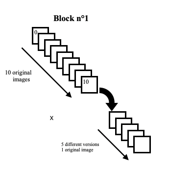
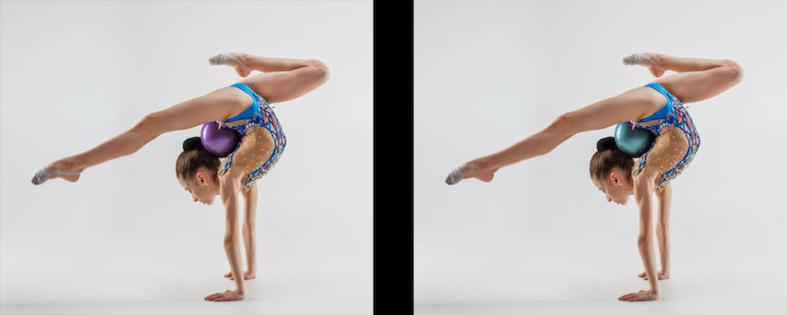
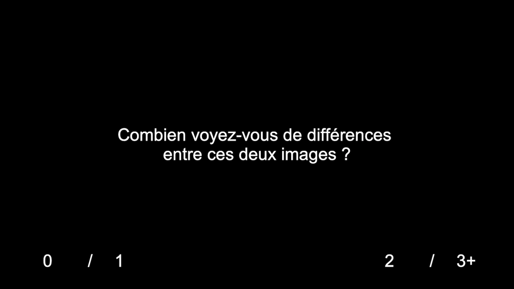

# Seven Differences Task
# CONTENTS OF THIS FILE
---------------------
* Introduction
* Seven Differences Task 
* Task design example
* Requirements
* Contributions
* More informations
* Contact


## INTRODUCTION
------------
Our research team is studying different aspects of psychiatric disorders. Our present project is all about exploring obsessive compulsive disorders' secret gardens. For that matter, we designed original home-made cognitive tasks, fresh out of the oven!


## Seven Differences Task 
------------

In case you still haven't figured it out, the aim of the task is to fetch for the differences between two images displayed simultaneously on the screen. 
We first had to turn our research lab into a Photoshop workshop, in order to edit original images by adding a certain number of differences (1 to 7) on each one of them.
There are 4 blocks of 10 original images each, that we have chosen wisely. Each original image is declined in 5 edited versions. 
Thus, each block contains a total of 50 images. The first block gather images with different valences of an emotional stimuli; while de the second block gathers emotionaly-neutral images. The third block is a set of caligraphy iamges in 5 differents languages :arabic, russian, hebraic, chinese, and tamoul. The fourth block contains images of chessboards with randomly-placed pieces. 




All the images are stored in the file "img", and all images are named following this form : img_XX_YY.png
    * XX is the number of the image
    * YY in the number of differences 
Supplementary images ('40','41','42') are used for training, and do not belong to the 4 blocks.

The stimuli is displayed for 7 seconds for the 100 first trials, and 5 seconds for the last 100 trials, then followed by the question "Combien voyez-vous de différences entre ces deux images ?" in french ("How many differences have you seen").
The participants have to choose among 4 propositions : 0 / 1 / 2 / 3+ . 

The task starts with instructions written in french, and are suited for use with a "Trackpad". 


## Task Design example
------------

Here is an example of the task. 





## REQUIREMENTS
------------
### Imports : 

We use the package PsychoPy under Python 3.6 to run the tasks. Furthermore, Seven Differences Task requires the import of time, as the time spent by the participants is a valuable data.

```python
import time
from list_images import images
from psychopy import core
from Template_Task_Psychopy.task_template import TaskTemplate
```
In order to import TaskTemplate, here are our recommendations: 

* First, to run the tasks you will  need to clone Template_Task_Psychopy repository from GitHub : 

Here's the <a href="https://github.com/ICRIN-lab/Template_Task_Psychopy.git"> link ! </a>

* Then, create a symbolic link locally with Template_Task_Psychopy : 

        yourtask_directory % ln -s ../Template_Task_Psychopy Template_Task_Psychopy


### Specificities : 

If you want to try this cognitive task using your keyboard, don't forget to switch the response_pad to False.


```python
class SevenDiff(TaskTemplate):
    nb_ans = 4
    response_pad = False  # has to be set on "True" if a trackpad is used.
```


## Contributions
------------

To contribute, please fork the repository, hack in a feature branch, and send a pull request.


## More informations 

Homepage: http://icrin.fr/

## Contact us

* Mail : contact@icrin.fr
* Twitter : https://twitter.com/RedwanMaatoug


